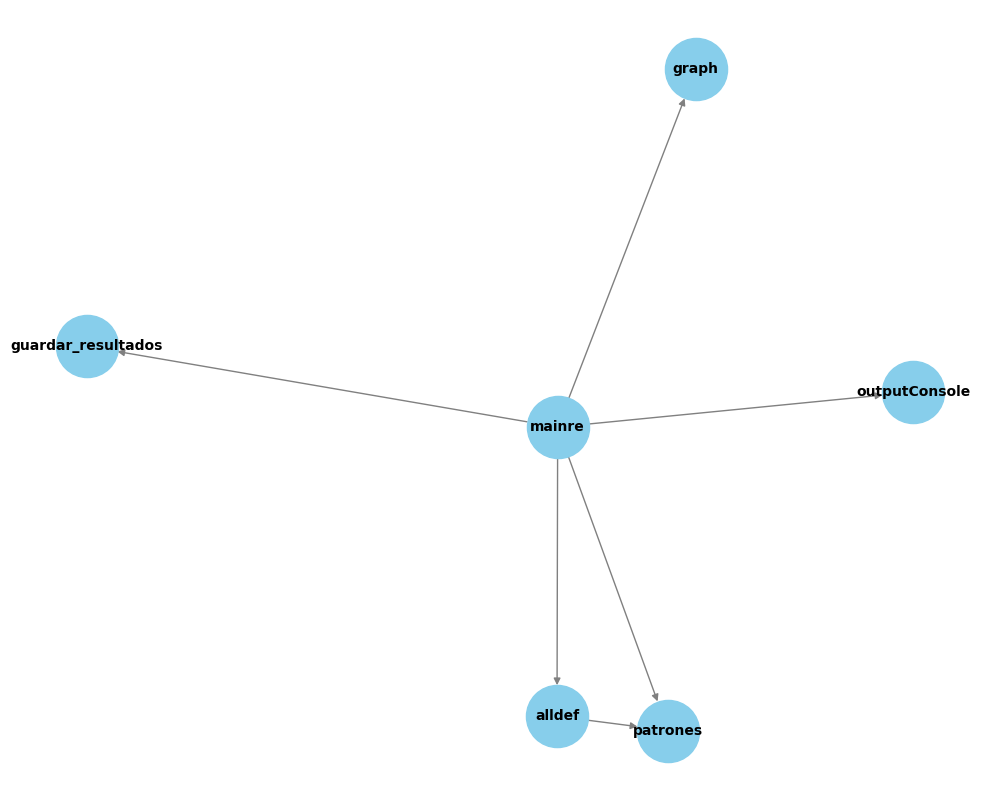

# DepGraph-AI

DepGraph-AI es una herramienta que analiza automáticamente las dependencias entre archivos de código Python y genera documentación inteligente utilizando modelos de lenguaje (LLMs). Perfecta para refactorizar, incorporar nuevos desarrolladores o detectar código frágil.

- Usa IA para explicar funciones.
- Identifica dependencias internas y externas.
- Genera gráficos de relaciones automáticos.
- Exporta resultados en JSON para análisis posterior.

---

## Parte de la Estructura del Proyecto

```
DepGraph-AI/
├── analyserCode/               # Carpeta con los archivos de código a analizar
├── LLM_model/
│   └── run_analysis.py         # Ejecuta el análisis con un modelo LLM
├── patrones.py                 # Define patrones a buscar en el código
├── alldef.py                   # Funciones auxiliares para procesar archivos
├── outputConsole.py            # Muestra resultados mejorados por consola
├── guardar_resultados.py       # Guarda resultados por archivo en JSON
├── graph.py                    # Genera grafo visual con NetworkX
├── main.py                     # Punto de entrada de la aplicación
├── resultados/                 # Salida por archivo individual
├── resultados_dependencias/    # Salida general del análisis y grafo
└── requirements.txt            # Requisitos del entorno Python
```

---

## Instalación y Requisitos

Requiere **Python 3.8+**. Para instalar todas las dependencias necesarias:

```bash
pip install -r requirements.txt
```

### Dependencias utilizadas:

#### Análisis y visualización:
- **networkx** – para construir el grafo de dependencias internas entre archivos.
- **matplotlib** – para mostrar y guardar el grafo como imagen (`.png`).

#### Modelos de Lenguaje (LLMs con Gemini/Google AI):
- **langchain-core==0.3.55** – núcleo para orquestación de cadenas de procesos.
- **langchain==0.1.20** – versión completa de LangChain con utilidades y abstracciones.
- **langchain-google-genai==2.1.3** – integración de LangChain con Gemini (Google Generative AI).
- **google-generativeai==0.8.5** – cliente oficial para usar Gemini directamente desde Python.
- **google-ai-generativelanguage==0.6.16** – APIs base de Google AI para modelos de lenguaje.

Estas librerías permiten analizar las funciones del código fuente utilizando IA para generar explicaciones automáticas.

---

## Cómo Ejecutarlo

1. Colocá tus archivos `.py` dentro de `analyserCode/`.
2. Ejecutá el análisis:

```bash
python main.py
```

3. El programa:
   - Analiza todas las importaciones entre archivos.
   - Separa las dependencias internas (del proyecto) de las externas (librerías).
   - Genera un archivo `dependencias.json`.
   - Visualiza un grafo de dependencias internas.
   - Usa un modelo LLM para explicar las funciones encontradas.

---

## Vista del Grafo de Dependencias

> Inserta aquí una imagen del archivo `resultados_dependencias/dependencias_internas.png` generado por `matplotlib`.



---

## Vista del Análisis con LLM

> Inserta aquí una imagen (screenshot) del resultado generado por el análisis con IA, por ejemplo, el resumen de una función o el output en consola/JSON.


---

## Resultados Exportados

- `resultados/[archivo].json` → resultados individuales.
- `resultados_dependencias/dependencias.json` → resumen general.
- Visualización de dependencias con NetworkX y Matplotlib.

---

## Personalización

- Modificá `patrones.py` para agregar nuevas reglas de análisis.
- Personalizá el comportamiento del modelo de lenguaje desde `LLM_model/run_analysis.py`.
